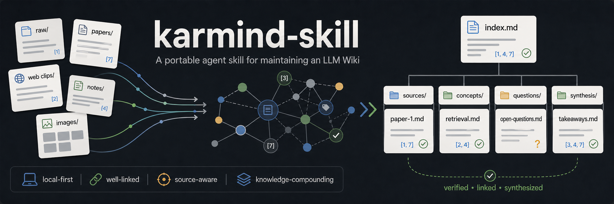

<div align="center">
  

  <h1>karmind-skill</h1>

  <p><strong>A portable Agent Skill for maintaining a Karpathy-style LLM Wiki.</strong></p>

  <p>
    <a href="LICENSE"></a>
    <a href="https://www.python.org/"></a>
    <a href="SKILL.md"></a>
    <a href=".claude-plugin/marketplace.json"></a>
  </p>

  <p>中文 | <a href="docs/zh/INSTALL.md">中文文档</a> | <a href="README.en.md">English README</a> | <a href="docs/en/INSTALL.md">English Docs</a></p>

</div>

`karmind-skill` 是一个面向编程 agent 的可移植 Skill，用来维护长期演化的 LLM Wiki：把原始资料整理成有引用、有链接、有历史记录、可持续更新的 Markdown 知识库。

它参考 Andrej Karpathy 的 [LLM Wiki](https://gist.github.com/karpathy/442a6bf555914893e9891c11519de94f) 理念：不要让 LLM 每次都从零开始检索碎片，而是让 agent 持续把资料编译进一个结构化 wiki。每次新增资料、提出问题、发现矛盾，wiki 都会变得更完整。

## 为什么需要它

普通 RAG 常常把资料切成 chunk，然后在提问时临时召回。LLM Wiki 的目标不同：它把原始资料、整理后的 wiki、操作 schema 分开，让 agent 像维护代码库一样维护知识库。

| 层级 | 路径 | 作用 |
| --- | --- | --- |
| Raw sources | `raw/` | 不可变证据层，保存论文、网页剪藏、访谈、图片、CSV、PDF 转文本等 |
| Wiki | `wiki/` | 可维护知识层，保存 source notes、实体页、概念页、问题页、综合分析页 |
| Schema | `AGENTS.md` | 本 wiki 的操作手册，定义目录、引用、缓存、日志和维护规则 |

## 核心能力

| 能力 | 说明 |
| --- | --- |
| 初始化 wiki | 创建 `raw/`、`wiki/`、`wiki/index.md`、`wiki/log.md`、`wiki/cache/`、`wiki/reports/` |
| 导入已有笔记 | 初始化时扫描已有文档，经用户确认后移动或复制到 `raw/imported/` |
| 资料摄取 | 从 raw source 提取 claim、entity、concept、timeline、矛盾和开放问题 |
| 缓存去重 | 用 `wiki/cache/ingest-cache.json` 记录 `pending`、`drafted`、`processed`、`failed`、`skipped` |
| 外部模型批处理 | 可用任意 OpenAI-compatible 模型批量生成待复核 source note drafts |
| Wiki 体检 | 输出断链、孤儿页、未摄取资料、缓存状态和维护建议到 `wiki/reports/` |
| 体检修复 | 用户明确要求后，按风险分级修复报告问题；高风险操作先确认 |
| Obsidian 友好 | 支持 wikilinks、assets、graph/backlinks、Dataview、Canvas、Marp 风格输出 |
| 多 agent 适配 | 支持 Codex、Claude Code、OpenCode、Trae、Skills CLI 和通用 `AGENTS.md` |

## 安装建议

推荐只在需要维护 LLM Wiki 的项目目录中启用这个 skill，不建议默认全局安装。它会扫描文档、维护 `raw/` 和 `wiki/`，放在普通代码项目的全局上下文里容易误触发。

安装到 wiki 目录后，普通问答默认基于这个 wiki：你可以直接提问，不需要每次写“基于 wiki 回答”。

### Claude Code Plugin

Claude Code 推荐使用 plugin marketplace 安装：

```text
/plugin marketplace add karmind-skills Lhy723/karmind-skill
/plugin install karmind-skill@karmind-skills
```

### Skills CLI

在目标 wiki 项目目录运行：

```bash
npx -y skills add Lhy723/karmind-skill --skill karmind-skill --agent '*' -y
```

### 内置安装脚本

内置脚本来自本仓库。先获取仓库：

macOS / Linux：

```bash
git clone https://github.com/Lhy723/karmind-skill.git /tmp/karmind-skill
```

Windows PowerShell：

```powershell
git clone https://github.com/Lhy723/karmind-skill.git "$env:TEMP\karmind-skill"
```

然后在目标 wiki 项目目录中运行：

macOS / Linux：

```bash
python /tmp/karmind-skill/scripts/install.py --target project-agents --project .
```

Windows PowerShell：

```powershell
python "$env:TEMP\karmind-skill\scripts\install.py" --target project-agents --project .
```

查看全部目标：

```bash
python /tmp/karmind-skill/scripts/install.py --list-targets
```

Windows PowerShell 中把脚本路径替换为 `"$env:TEMP\karmind-skill\scripts\install.py"`。

### 开发者本地安装

本地 checkout 预览：

```bash
npx -y skills add . --list
```

安装当前本地版本：

```bash
npx -y skills add . --skill karmind-skill --agent '*' -y
```

Claude Code 本地插件安装：

```text
/plugin marketplace add karmind-local /path/to/karmind-skill
/plugin install karmind-skill@karmind-local
```

## 快速开始

在目标目录打开你的 agent，然后直接说：

```text
使用 karmind-skill 在当前目录初始化一个 LLM Wiki。先扫描已有笔记或文档，列出候选项，询问我是移动、复制还是跳过；确认后再创建 raw/、wiki/、index、log、cache 和 reports。
```

放入资料后继续说：

```text
使用 karmind-skill 摄取新资料。请按默认目录寻找待处理资料，创建 source note，更新相关实体、概念、问题或综合页面，并维护默认索引、日志和缓存。
```

如果 raw 文件很多：

```text
使用 karmind-skill 检查待处理资料。先建议整理顺序；如果适合外部模型批处理，请先 dry run，说明会处理哪些文件、使用什么模型和输出哪些报告，等我确认后再运行。
```

手动兜底命令：

macOS / Linux：

```bash
python /tmp/karmind-skill/scripts/init_wiki.py . --scan-existing
```

Windows PowerShell：

```powershell
python "$env:TEMP\karmind-skill\scripts\init_wiki.py" . --scan-existing
```

## 推荐目录结构

```text
my-llm-wiki/
├── AGENTS.md
├── raw/
│   └── assets/
└── wiki/
    ├── index.md
    ├── log.md
    ├── overview.md
    ├── sources/
    │   └── _drafts/
    ├── entities/
    ├── concepts/
    ├── questions/
    ├── synthesis/
    ├── cache/
    │   └── ingest-cache.json
    ├── reports/
    │   ├── doctor-report.md
    │   └── batch/
    └── templates/
```

## 常用工作流

优先用自然语言让 agent 执行工作；脚本是给 agent 或用户在需要时调用的确定性工具。

| 工作流 | 推荐提示 |
| --- | --- |
| 初始化 wiki | `使用 karmind-skill 在当前目录初始化一个 LLM Wiki。先扫描已有笔记或文档，列出候选项，并询问我是移动、复制还是跳过。` |
| 摄取资料 | `使用 karmind-skill 摄取新资料。` |
| 整理待处理资料 | `使用 karmind-skill 查看待处理资料，按重要性建议下一批要整理的内容，然后等我确认。` |
| 批量模型整理 | `使用 karmind-skill 配置外部模型批处理。先 dry run，告诉我会处理哪些文件、使用什么模型和输出哪些报告，再等我确认运行。` |
| 强制重新提取 | `使用 karmind-skill 强制重新提取。请先说明会重置哪些缓存项，确认后再执行。` |
| 默认问答 | `这个观点有哪些证据？` |
| 对比分析 | `把 A 和 B 的差异整理成表格。` |
| 追溯来源 | `这个结论来自哪些 source？` |
| 归档问答结果 | `把刚才的回答归档。` |
| Wiki 体检 | `使用 karmind-skill 做一次健康检查。` |
| 修复体检问题 | `使用 karmind-skill 修复最新体检报告中的问题。不要删除页面；需要合并、拆分或重命名时先问我。` |

当缓存中有多个 pending raw 文件时，`摄取新资料` 会先询问处理方式：外部模型批处理、当前 agent 手动循环处理、只处理下一篇，或暂缓。

外部模型批处理默认只写入 `wiki/sources/_drafts/` 并把缓存标记为 `drafted`；复核后才提升到正式 `wiki/sources/` 并标记为 `processed`。

体检报告默认写入：

```text
wiki/reports/doctor-report.md
```

模型批处理报告默认写入：

```text
wiki/reports/batch/
```

模型 API key 推荐通过环境变量或本地 `.env.local` 配置，不要写入 wiki。见 [模型 API Key 配置](docs/zh/MODEL_KEYS.md) / [Model API Key Configuration](docs/en/MODEL_KEYS.md)。

体检修复策略：

- 低风险问题直接修：明显断链、缺失索引、孤儿页挂接、缺失引用、问题页占位。
- 中风险问题先给方案：合并重复页、拆分大页、重命名页面。
- 高风险问题必须先确认：删除页面、覆盖 source note、重置缓存、批量重摄取、修改 schema。
- 修复后更新 `wiki/index.md`、追加 `wiki/log.md`，并重新运行体检。

## Agent 适配

| Agent / 工具 | 推荐方式 | 文档 |
| --- | --- | --- |
| Skills CLI | 项目目录中 `npx skills add` | [中文](docs/zh/SKILLS_CLI.md) / [English](docs/en/SKILLS_CLI.md) |
| 模型 API Key | 环境变量或本地 `.env.local` | [中文](docs/zh/MODEL_KEYS.md) / [English](docs/en/MODEL_KEYS.md) |
| Codex | 项目级 `.agents/skills` | [中文](docs/zh/CODEX.md) / [English](docs/en/CODEX.md) |
| Claude Code | Plugin marketplace | [中文](docs/zh/CLAUDE_CODE.md) / [English](docs/en/CLAUDE_CODE.md) |
| OpenCode | 项目级 `.opencode/skills` | [中文](docs/zh/OPENCODE.md) / [English](docs/en/OPENCODE.md) |
| Trae | 项目规则 + 完整 skill 组合安装 | [中文](docs/zh/TRAE.md) / [English](docs/en/TRAE.md) |
| 其他 agent | 项目级 `AGENTS.md` / `CLAUDE.md` | [中文](docs/zh/OTHER_AGENTS.md) / [English](docs/en/OTHER_AGENTS.md) |

## 本仓库结构

```text
.
├── SKILL.md                    # 标准 Agent Skill 入口
├── .claude-plugin/             # Claude Code marketplace manifest
├── agents/openai.yaml          # Codex App 可选元数据
├── references/                 # 按需读取的 skill 参考文档
├── scripts/                    # 初始化、缓存、批处理、体检、安装脚本
├── adapters/                   # 通用 agent 规则模板
├── assets/                     # README banner 等静态资源
├── plugins/karmind-skill/      # Claude Code plugin 分发目录
├── docs/
│   ├── en/
│   └── zh/
├── examples/
└── tests/
```

## 设计原则

- 原始资料不可变，wiki 页面可维护。
- 每个重要结论都应该能追溯到 source note 或 raw source。
- `index.md` 负责内容导航，`log.md` 负责时间线记录。
- `ingest-cache.json` 负责整理状态。外部模型输出先进入 `drafted`，复核后才进入 `processed`。
- 矛盾和不确定性是知识库的一部分，应该明确记录。
- 先用纯 Markdown、`rg` 和索引文件；规模真的变大后，再考虑向量数据库、MCP 搜索或其他工具。
- 输出形态不局限于 prose，也可以是表格、时间线、图表、Marp slide markdown 或 Obsidian Canvas notes。

## 许可证

MIT. See [LICENSE](LICENSE).

## Star 历史

[](https://www.star-history.com/#Lhy723/karmind-skill&Date)
